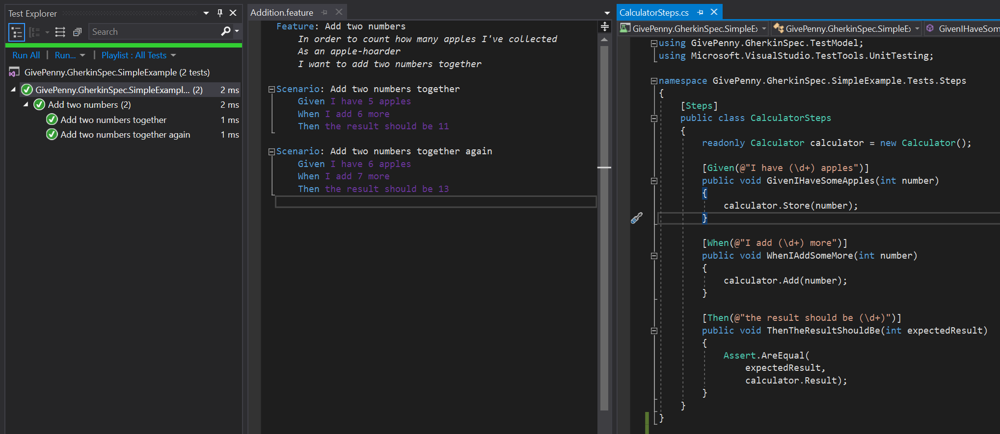
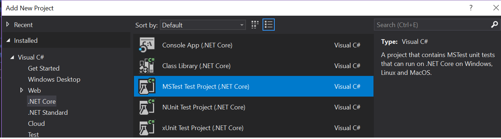

# GherkinSpec

## Overview

A lightweight, cross-platform .NET Standard test adapter that discovers Gherkin tests from feature files and executes them.  Inspired by the giants of Cucumber, SpecFlow and BDDfy, filling a niche between them for microservice tests that are both lightweight (e.g. BDDfy) yet self-documenting in a natural language (e.g. SpecFlow/Cucumber).

Published package: https://www.nuget.org/packages/GivePenny.GherkinSpec.TestAdapter



## Highlights

* Fully cross-platform (.NET Standard)
* No generated code files means cleaner pull requests (i.e. no *.Designer.cs)
* Use with any unit test framework or assertions library
* Supports dependency injection

## Getting started

The best way to pick GherkinSpec up is to see [the simple example repository](https://github.com/GivePenny/GherkinSpec.SimpleExample), download the code and just try it out.

If you want to create a new test project from scratch ...

1. Create a new .NET Core project for your tests.
2. Add Nuget package references to [GherkinSpec.TestAdapter](https://www.nuget.org/packages/GivePenny.GherkinSpec.TestAdapter) and [Microsoft.NET.Test.Sdk](https://www.nuget.org/packages/Microsoft.NET.Test.Sdk).
3. Add a plain-text file (ending in .feature) to your project, mark it as an Embedded Resource (either in the csproj file, or in Visual Studio's Properties pane)
4. Write your C# steps, tagging the class with a `[Steps]` attribute and your methods with `[Given]` or `[When]` or `[Then]`
5. Add a reference to a unit test framework of your choice if you would like to perform Assertions, for example [MSTest.TestFramework](https://www.nuget.org/packages/MSTest.TestFramework)

Steps 1, 2 and 5 can be speeded up by creating your test project using one of these templates in Visual Studio, either for MS Test, NUnit or xUnit.  You will still need to add a reference to GherkinSpec.TestAdapter.



## Full feature list

* Open source
* .NET CLI compatible (`dotnet test`)
* Visual Studio / Visual Studio Code compatible
* Azure DevOps compatible (test results reported)
* Supports `async`/`await` steps
* Efficiently runs tests in parallel (if they contain `async` steps) - great for eventually-consistent message-based microservices
* Fully cross-platform (.NET Standard)
* No generated code files means cleaner pull requests (e.g. no *.Designer.cs files)
* Minimal 3rd-party dependencies
* Use with any unit test framework or assertions library (MS Test, NUnit, xUnit)
* Supports dependency injection
* Support for the full Gherkin syntax, including tables and doc-strings
* Easy logging from within steps.
* Support for clear tests of eventually consistent services via `[EventuallySucceeds]` attribute

## Gotchas

* Make sure you add the Test SDK package to your test project, again see the csproj for the simple example (e.g. `<PackageReference Include="Microsoft.NET.Test.Sdk" Version="15.9.0" />`).  If you don't then tests won't get detected.
* When creating a new .feature file, make sure that it is added as an Embedded Resource (see the [csproj of the simple example](https://github.com/GivePenny/GherkinSpec.SimpleExample/blob/master/GherkinSpec.SimpleExample.Tests/GherkinSpec.SimpleExample.Tests.csproj) - in Visual Studio this can also be set in the Properties pane when the file is selected).
* When using steps from referenced assemblies, make sure that the assembly has been loaded (for example by referencing a type in that assembly: `.AddAllStepsClassesAsScoped(typeof(ReferencedAssembly.StepsClass).Assembly)`).

```xml
  <ItemGroup>
    <EmbeddedResource Include="Features/**/*.feature"/>
  </ItemGroup>
```

* If you keep getting .designer.cs files appear, uninstall (or disable) the SpecFlow Extension for Visual Studio or name your files .gherkin instead of .feature.
  * See the "useful links" section below for a replacement syntax highlighting extension (although the files must end in .feature )
  * After uninstalling the SpecFlow extension, feature/gherkin files can be created just by creating plain text files ending in .feature or .gherkin.  Remember to mark them as an Embedded Resource if you haven't set the catch-all in the csproj.
* Steps classes and methods must be public. This is for two reasons: firstly, the classes are accessed from outside the steps assemblies by the Test Runner so it logically makes sense to advertise that.  Secondly, code analysis tools can flag up private classes and methods as being unused and recommend that they are removed.  Requiring them to be public avoids a requirement for these code analysis warnings to be suppressed.

## Complete examples

* [Simple example repository](https://github.com/GivePenny/GherkinSpec.SimpleExample)
* [Feature-rich example repository](https://github.com/GivePenny/GherkinSpec.ComplexExample)

## Reference guide / concepts
* [Feature discovery](docs/Feature-Discovery.md)
* [Steps classes](docs/Steps.md)
* [Before/after hooks](docs/Hooks.md)
* [Dependency injection](docs/DependencyInjection.md)
* [Logging](docs/Logging.md)
* [Eventually-consistent service support](docs/EventuallyConsistentServices.md)
* [Roadmap](docs/Roadmap.md)

## Third-party references and useful links

* [Full Gherkin syntax](https://docs.cucumber.io/gherkin/reference/)
* Visual Studio Code Gherkin syntax highlighting and templating extensions:
  * [Steve Purves' extension](https://marketplace.visualstudio.com/items?itemName=stevejpurves.cucumber)
  * [Interesting review of 3 extensions](https://automationpanda.com/2018/08/09/gherkin-syntax-highlighting-in-visual-studio-code/)
* Visual Studio Gherkin syntax highlighting:
  * https://marketplace.visualstudio.com/items?itemName=MadsKristensen.SyntaxHighlightingPack