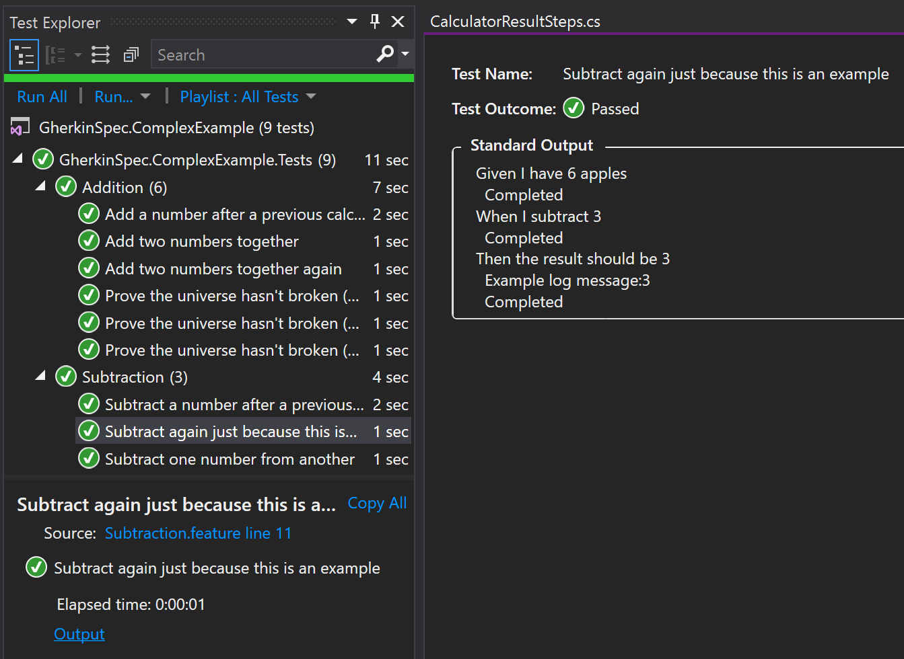

# Logging

## How to

The `dotnet test` CLI and the Visual Studio Test Explorer both capture logging output from each test that runs and stores it alongside that test's results.  This means that, when many tests are running in parallel, log messages from different tests don't interweave each other in a confusing fashion in the console.  Rather, each test's messages can be viewed clearly without messages from other tests that happened to be running at the same time getting in the way.  

Two approaches are available for you to log messages out from your tests.

### Approach 1: lightweight, no dependencies

To log messages out without referencing other packages, ask for an `ITestLogAccessor` in the constructor of the relevant steps class, and then use it during a method.  This approach works out-of-the-box without requiring any custom dependency injection setup code.

```csharp
[Steps]
public class CalculatorSteps
{
    private readonly ITestLogAccessor logger;

    public CalculatorSteps(ITestLogAccessor logger)
    {
        this.logger = logger;
    }

    [Then(@"the result should be (\d+)")]
    public async Task ThenTheResultShouldBe(int expectedResult)
    {
        // ...
        logger.LogStepInformation("Example log message:" + expectedResult);
        // ...
    }
}
```

For a complete example, see the [feature-rich example](https://github.com/GivePenny/GherkinSpec.ComplexExample).

### Approach 2: with Microsoft.Extensions.Logging

This second approach can be better as it allows any messages that your test subject logs to `Microsoft.Extensions.Logging.Abstractions.ILogger` to also be captured and to be routed to the correct test case results.  This is more powerful but requires a dependency on Microsoft's logging framework (which is probably a good thing, so we created this adapter).  It also requires you to use custom dependency injection setup (see below).

See the steps in the [GivePenny GherkinSpec Logging adapter](https://github.com/GivePenny/GherkinSpec.Logging/blob/master/Readme.md) project.

## Viewing the log messages from either approach

To view the messages that were logged for a test, view the output of the test.  To do this in Visual Studio, select your test in the Test Explorer after running it and then click the _Output_ link.  In the screenshot below, the output link is in the bottom left corner and the results on the right show the logged line `Example log message:3` under the relevant step.



## Logging with custom dependency injection

The first approach above works with the default, built-in dependency injection of GherkinSpec.  If a more complex dependency-injection framework is used then the `ITestLogAccessor` instance available on the `Logger` property of the `TestRunContext` must be registered as a singleton.  Don't create a new instance of the `ITestLogAccessor` as it will not receive the context of the currently executing test so will fail to log.  The [feature-rich example](https://github.com/GivePenny/GherkinSpec.ComplexExample) shows a working implementation.  An example using .NET Core's Dependency Injection extension is:

```csharp
[Steps]
public static class Dependencies
{
    [BeforeRun]
    public static void Setup(TestRunContext testRunContext)
    {
        var services = new ServiceCollection();
        testRunContext.ServiceProvider = services
            // ... set up other things, including step definitions, here
            .AddSingleton(testRunContext.Logger)
            .BuildServiceProvider();
    }

    [AfterRun]
    public static void Teardown(TestRunContext testRunContext)
    {
        var typedProvider = (ServiceProvider)testRunContext.ServiceProvider;

        typedProvider.Dispose();
    }
}
```

## Why are two approaches available?

The second approach is more powerful (most test subjects will already be logged to ILogger for example) but requires a dependency on fixed versions of Microsoft's interfaces and also requires dependency injection and logging configuration.  We wanted to keep both the simple approach and the full `ILogger` approaches available.
